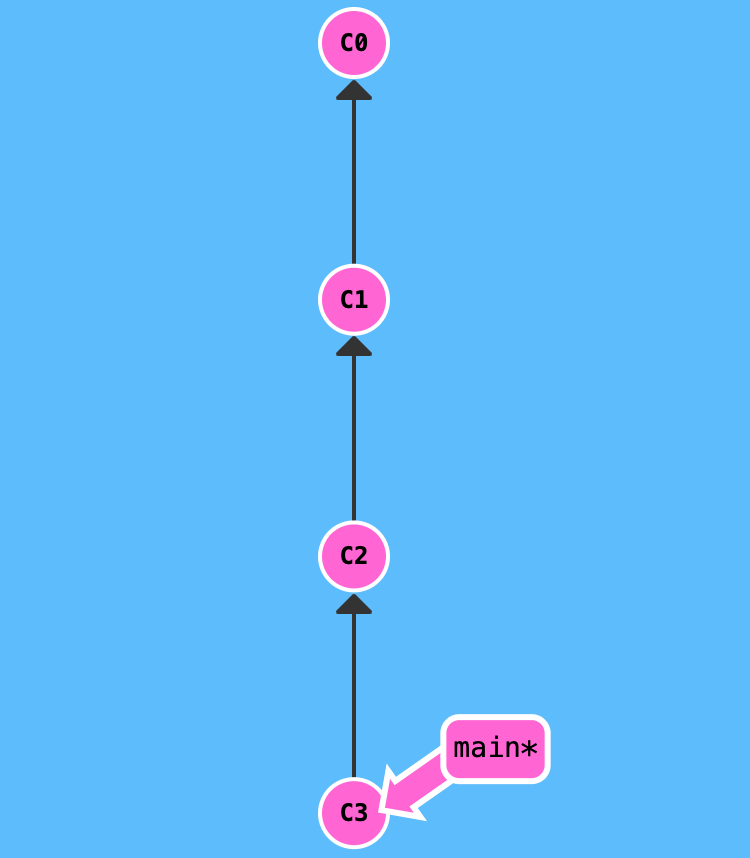

## Инструкция по работе с Git

> **Git** - это консольная утилита, для отслеживания и ведения истории изменения файлов, в вашем проекте. Чаще всего его используют для кода, но можно и для других файлов. Например, для картинок - полезно для дизайнеров.

For more information, see the [Git for beginners](https://habr.com/ru/post/541258/).

Example:

### Основные команды Git

- _git init_ - инициализация локального репозитория;
- _git status_ - получить информацию от git о его текущем состоянии;
- _git add_ - добавить файл или файлы к следующему коммиту;
- _git commit -m 'massage'_ - создание коммита;
- _git log_ - вывод на экран истории всех коммитов с их хеш-кодами;
- _git checkout_ - переход от одного коммита к другому;
- _git checkout master_ - вернуться к актуальному состоянию и продолжить работу;
- _git diff_ - увидеть раазницу между текущим файлом и закоммиченным файлом;

## CAT
Название команды - это сокращения от слова catenate. По сути, задача команды cat очень проста - она читает данные из файла или стандартного ввода и выводит их на экран. Это все, чем занимается утилита

## Синтаксис языка Markdown

- ### Заголовок – выделение заголовков
  Количество символов “#” задаёт уровень заголовка
  (поддерживается 6 уровней).
- = или - – подчёркиванием этими символами (не менее 3 подряд) выделяют заголовки первого (“=”) и второго (“-”) уровней.
- ** Полужирное начертание** или ** Полужирное начертание**
- _Курсивное начертание_ или _Курсивное начертание_
- **_Полужирное курсивное начертание_**
- ~~Зачёркнутый текст~~
- - Строка – ненумерованные списки, символ “\*” в начале строки
- 1, 2, 3 … – нумерованные списки

Добавили строку на Гитхаб
